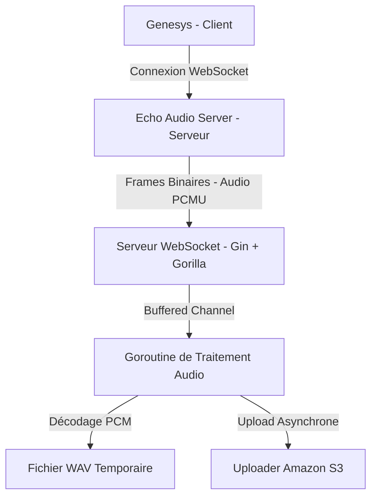

Coming soon ...

export $(grep -v '^#' .env | xargs)
2

```mermaid
graph TD
    Genesys-Webphonic[Genesys - Client] -->|Connexion WebSocket| Echo-Audio-Server[Echo Audio Server - Serveur ]
    Echo-Audio-Server -->|Frames Binaires - Audio PCMU| WebSocketServer[Serveur WebSocket - Gin + Gorilla]
    WebSocketServer -->|Buffered Channel| AudioProcessor[Goroutine de Traitement Audio]
    AudioProcessor -->|Décodage PCM| WAVEncoder[Fichier WAV Temporaire]
    AudioProcessor -->|Upload Asynchrone| S3Uploader[Uploader Amazon S3]
```
