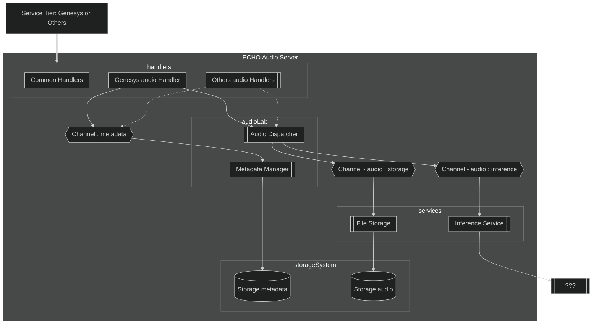

# E.C.H.O Audio Server

## Introduction

This project is designed to handle and process audio data from various sources, routing it to different services based on requirements. The core functionalities include:

- Receiving audio inputs from multiple sources.
- Recording metadata associated with the audio inputs for tracking and analysis.
- Dispatching the audio data to the appropriate services, such as:
  - **Storage** for saving audio files.
  - **Inference** for processing and analysis.

Currently, we have implemented integration for **Genesys**.

### Audio from Genesys
The Genesys integration supports audio data provided via webhooks. 

For details, refer to the interface contract and technical requirements documentation:
[Genesys AudioHook protocol](https://developer.genesys.cloud/devapps/audiohook)

### Audio from others
*Not implemented yet*

## Architecture

### Technical Architecture (a.k.a. Infrastructure)

*Currently, we only support audio from Genesys.*


### Project Structure

The project is organized into the following directories, each serving a specific purpose:

### `router`
This module centralizes all the endpoints of the project, acting as the entry point for routing requests to the appropriate handlers.

### `handler`
Contains generic handlers, such as:
- **`/health`**: A health check endpoint to ensure the service is running.
- **404 Errors**: A generic handler for undefined routes.

### `audiohook_genesys`
Dedicated to handling specific logic for **Genesys** audio sources. [Genesys AudioHook protocol](https://developer.genesys.cloud/devapps/audiohook)

*This module can be extended by adding similar handlers for other audio sources as they are integrated.*

### `audiolab`
Responsible for managing audio metadata and the `audio_dispatcher`. 

This is the core module for audio-related operations and can be expanded with additional generic audio processing functionalities.

### `service`
Contains implementations of various services, currently including:
- **`storage_file`**: Handles file-based storage of audio data.
- **`inference`**: Performs analysis and processing on audio data.


This modular structure ensures scalability and makes it easy to add support for new audio sources or services in the future.

### Application Architecture


** Each service has its own channel. 

If additional services are needed, declare new channels and add to the Audio Dispatcher (in `app.go - setup`) accordingly.
```
audioDispatcher := audiolab.NewAudioDispatcher(audioStorageChan, audioInferenceChan)
```
## Run Locally

Add a `.env` file with the following variables in the root of the project - default value in `utils/config.go`):

| Environment Variable | Description                                                                                                                                           |
|----------------------|-------------------------------------------------------------------------------------------------------------------------------------------------------|
| `PORT`               | Optional. The port number on which the application will listen.                                                                                       |
| `AUDIO_TEMP_REP`     | Required. The local directory path used to store temporary audio files. Ensure that the application has read and write permissions to this directory. |
| `DEBUGGING`          | Optional.                                                                                                                                             | 
| `AWS_REGION`         | Required. The AWS region where resources will be deployed, e.g., us-east-1.                                                                           |
| `S3_BUCKET_NAME`     | Required. The name of the bucket to be used for storage audio                                                                                         |
| `AWS_S3_ENDPOINT`    | Required. Custom endpoint URL for MinIO or other S3-compatible storage                                                                                |
| `AWS_S3_USE_SSL`     | Required. Always false                                                                                                                                |
| `AWS_S3_ACCESS_KEY`  | Required. MinIO or other S3-compatible storage ACCESS_KEY                                                                                             |
| `AWS_S3_SECRET_KEY`  | Required. MinIO or other S3-compatible storage SECRET_KEY                                                                                             |

Apply `.env`:

```
export $(grep -v '^#' .env | xargs)
```

Build:

```
go build
```

Run:

```
go run audio-server
```
